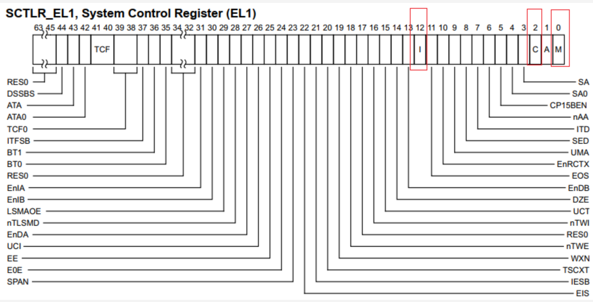
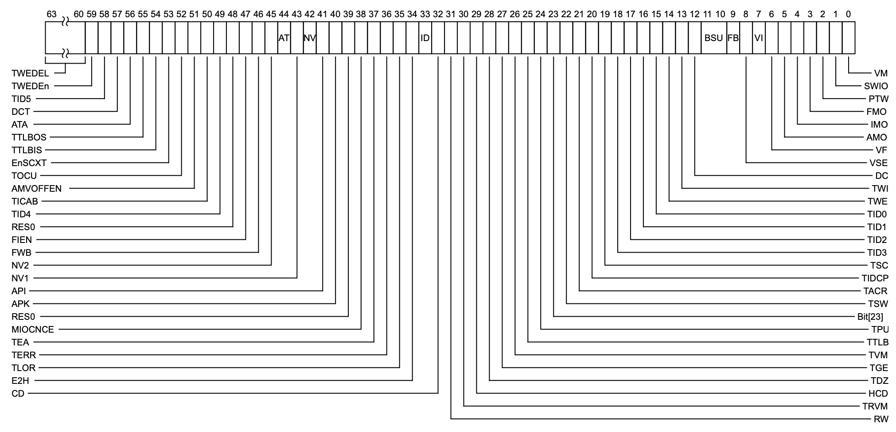
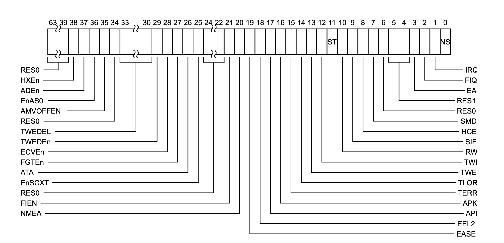
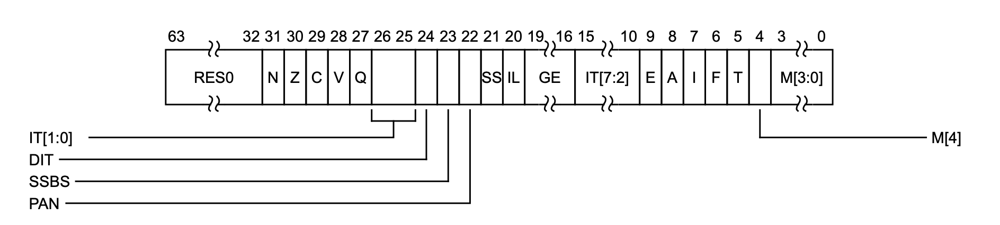

# 任务目标
## 1. 增加printf函数
## 2. 根据boot protocal配置相关寄存器
## 3. 进入el1 kernel
### 进入内核态前的准备工作
1. 关闭地址翻译和cache
    + MMU = off
    + D-cache = off
    + I-cache = on or off
    + x0 = physical address to the FDT blob
2. 配置EL2，EL3信息
    + EL1时使用aarch64架构
    + 低于EL3时使用aarch64架构
    + EL0-EL2执行在non-secure world
    + 屏蔽EL3下的SError，Interrupt，FInterrupt
### 相关寄存器配置
1. SCTLR_EL1    
    系统控制寄存器
    
    + 关闭mmu：M位置0
    + 关闭d-cache：C位置0
    + 关闭i-cache：I位置0
    + 设置保留段：RES0（45-63）位置1,RES0（32-34）置1
2. HCR_EL2  
    虚拟化配置寄存器
    
    + 当异常级别为EL1时，为aarch64：RW置1
3. SCR_EL3  
    安全控制寄存器
    
    + 设置保留段：RES0，RES1（4-6）置1
    + 设置下一异常级别的架构为aarch64：RW置1
    + 设置EL3以下的异常级别处于non-secure world：NS置1

4. SPSR_EL3     
    Saved Program Status Register (EL3)，程序状态保存寄存器
    
    + 屏蔽EL3下的SError，Interrupt，FInterrupt：A，I，F为设置为1
    + 设置从EL3异常返回时，使用的栈指针（使用EL1的栈指针）：M[3:0]设置为101
### 
## 3. 配置完毕后跳转到el1

# linux boot protocal
1. 

# 