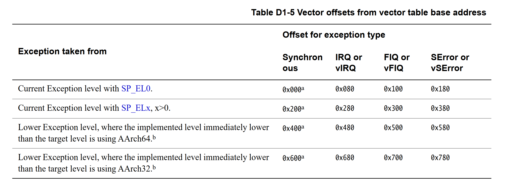
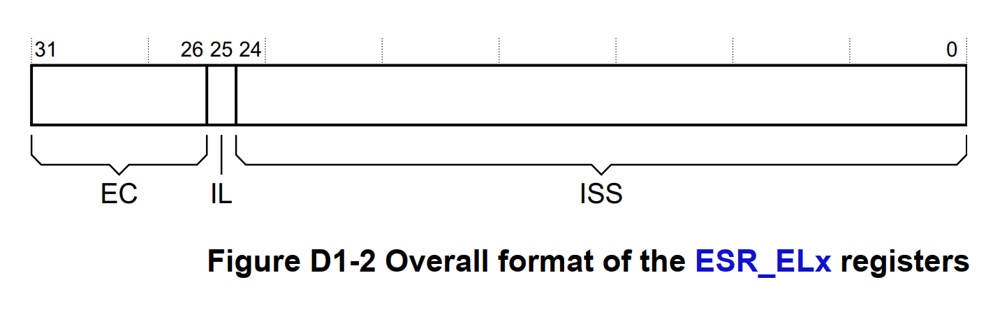

# 任务目标
## 1. 添加异常向量表
### 数据结构
1. ventry
``` c
.macro    ventry    label
// 按7字节对齐
.align    7
b    \label
.endm
```

### 
# arm64 异常
## 异常类型
1. 同步异常     
异常的产生与当前执行的指令相关（运行指令，导致异常的发生），例如对空地址进行访存，执行系统调用指令（SVC），指令异常，数据异常，对齐异常等。
2. 中断     
普通的中断。中断的触发通常是异步的，并且是由外部设备触发。
3. 快速中断     
高优先级中断。快速中断触发时会做高优先级的标记，会让中断处理器优先处理快速中断。linux中没有实现快速中断
4. System Error     
系统异常时触发的外部中断，由外设异步触发。SError本质上是一种异步外部abort（asynchronous external abort）。所谓异步，就说是发生异常时硬件(相关的寄存器)不能提供有效信息用于分析定位，异常发生时的指令，并不是导致异常的指令。外部意味着异常来自于外部存储系统(相较于CPU来说，MMU是内部的)。通常是硬件触发的问题，比如硬件的clock出问题或者硬件本身的问题导致的bus访问硬件时出现问题。

## 异常向量
当处理器发生一个异常，将处理器陷入到某个异常等级时，处理器会强制跳转到异常向量指向的地址。异常向量存在于向量表中异常所处的异常级别。      
异常向量表由一组在内存中字对齐的地址构成，每个地址为一个异常向量的地址。        
每个异常级别都有一个关联的向量基地址寄存器(Vector Base Address Register, VBAR)，它定义了该异常级别的表的异常向量表基地址，也就是说每个异常级别都有一个异常向量表。（VBAR_EL1，VBAR_EL2）        
异常向量的地址由异常发生的EL与发生的异常等级有关

+ Current Exception level with SP_EL0  
发生异常不会导致异常级别切换，并且使用EL0栈指针
+ Current Exception level with SP_ELx, x>0  
发生异常不会导致异常级别切换，并且使用EL1/2/3栈指针
+ Lower Exception level, where the implemented level immediately lower than the target level is using AArch64 
如果发生异常会导致异常级别切换，并且比目的异常级别（切换的目的异常级别）低一级的异常级别运行在AARCH64模式
+ Lower Exception level, where the implemented level immediately lower than the target level is using AArch32  
如果发生异常会导致异常级别切换，并且比目的异常级别（切换的目的异常级别）低一级的异常级别运行在AARCH32模式
+ 每一个异常向量占用的空间为0x80(128)byte，不仅仅只有一个跳转指令，可以容纳更多的指令，最多容纳32条指令。

## 异常向量表与异常向量表寄存器
1. 异常向量表（发生异常的过程）
一个异常向量表包含16条异常向量入口（4个异常级别*4种异常状态）
2. VBAR寄存器

## 相关寄存器
1. ESR_EL1, ESR_EL2, and ESR_EL3
异常描述寄存器，发生异常时，该寄存器纪录发生的异常的具体信息

    + EC
    + IL
    + ISS

# 笔记
## 汇编中macro的用法
``` c
// 宏开始
.macro <宏名称> <参数>
<ins>
<ins>
// 宏结束
.endm

.macro    ventry    label
.align    7
// 使用参数时，需要加反斜杠
b    \label
.endm
```
## 